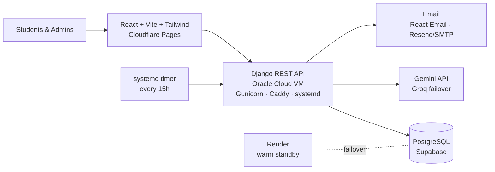

# myScholy

[](https://github.com/FOFANA459-2023/myScholy/actions/workflows/ci.yml)

A scholarship board that helps students — starting with students across Africa — find and apply for opportunities they would otherwise miss.

**Live at [myscholy.pages.dev](https://myscholy.pages.dev)**

## Why I built this

A lot of good scholarships go unclaimed because students hear about them too late, or never at all. myScholy puts live opportunities in one place, lets students check whether they actually qualify, and emails them new ones automatically so they don't have to keep checking.

I built the whole thing myself — frontend, API, infrastructure — and it runs in production with real users.

## What it does

**For students**
- Browse and filter live scholarships by country, degree level, and funding type — every filtered view is a shareable URL
- Ask the site assistant questions, or take a short quiz that tells you which scholarships fit you (Gemini-powered)
- Get an email digest of 5 live scholarships every 15 hours
- Every scholarship has its own social preview card, so links shared on WhatsApp or Facebook look right

**For admins**
- Post a scholarship by pasting the announcement text, a link, or a PDF — the form fills itself, and it warns you if the scholarship is already on the board
- Dashboard with statistics, a user directory, CSV exports, and archive/repost workflows
- A message center that works like an email inbox: contact-form threads grouped by sender, with replies sent from the myScholy address

## How it's built



- **Frontend** — React (Vite) + Tailwind CSS on Cloudflare Pages, deployed by GitHub Actions
- **Backend** — Django REST Framework on an Oracle Cloud VM (Gunicorn behind Caddy with automatic HTTPS, managed by systemd), with a warm standby on Render sharing the same database for one-variable failover
- **Data** — PostgreSQL (Supabase) + Redis caching
- **AI** — Google Gemini with automatic Groq failover on rate limits

## Things I'm proud of

- The data layer is a single hand-written fetch wrapper: it attaches and refreshes JWTs (concurrent refreshes collapse into one request), de-duplicates identical in-flight GETs, and serves a stale-while-revalidate cache where each mutation declares the tags it invalidates
- Every push runs ESLint/Ruff, 200+ unit tests (Vitest + Django), and Playwright end-to-end tests, then deploys automatically if everything is green
- Server-side URL fetching has an SSRF guard, public endpoints are rate-limited, permissions are role-based with cached lookups, and the browser never holds a database key
- The digest job records each send in the database, so even if two servers trigger it, students can't get emailed twice — and it runs on a systemd timer because cron can't express "every 15 hours"

## Run it locally

```bash
npm install
cp .env.example .env       # point VITE_BACKEND_URL at the Django API
npm run dev                # dev server on :5173
```

| Command | Purpose |
| --- | --- |
| `npm run dev` | dev server on :5173 |
| `npm run build` | production build |
| `npm run preview` | serve the build on :4173 |
| `npm run lint` | ESLint |
| `npx vitest run` | unit tests |
| `npx playwright test` | end-to-end tests |

The backend lives in its own repo: [myScholyScholarship_Backend](https://github.com/FOFANA459-2023/myScholyScholarship_Backend).

---

## Developer notes

<details>
<summary><strong>Project layout</strong></summary>

```
src/
  App.jsx                  routes (everything but the landing page is lazy)
  main.jsx
  styles/index.css         Tailwind entry, base styles, shared component classes
  lib/
    api/client.js          fetch wrapper: auth, refresh, dedupe, cache, abort
    api/endpoints.js       every API call, with its cache policy
    auth.js                session store (useSession)
    cache.js               memory + sessionStorage TTL cache
    hooks.js               useApi, useMutation, useDebouncedValue, useMediaQuery
    format.js              shared Intl formatters
    cn.js
  components/
    ui/                    Button, Card, Field, Feedback, Pagination
    layout/                Navbar, Footer, SiteLayout (Page, PageHeader)
    ErrorBoundary.jsx
  features/
    scholarships/          card, filters, useScholarshipQuery
    marketing/             carousel, programs, FAQ
  routes/ProtectedRoute.jsx
  pages/                   one file per screen, admin screens under pages/admin
```

</details>

<details>
<summary><strong>Data layer</strong></summary>

`lib/api/client.js` is the only place that calls `fetch`. It handles:

- attaching the JWT and refreshing it once on a `401`, collapsing concurrent
  refreshes into a single request
- de-duplicating identical in-flight GETs
- serving cached responses with stale-while-revalidate
- `AbortSignal` support, so an unmounted screen stops waiting — note the shared
  request itself keeps running and fills the cache, because cancelling it would
  break every other caller waiting on the same URL
- turning DRF error bodies into an `ApiError` with per-field messages

Cache policy lives in `lib/api/endpoints.js`, next to the call it applies to.
Mutations declare the tags they invalidate:

```js
create: (payload) =>
  api.post("/admin/scholarships/", payload, {
    invalidates: [TAGS.scholarships, TAGS.statistics],
  }),
```

Screens use `useApi`, which aborts on unmount and ignores superseded responses,
so a fast typist can never have an old search overwrite a newer one.

</details>

<details>
<summary><strong>Filtering</strong></summary>

`useScholarshipQuery` keeps filter state in the URL (`?q=&country=&ongoing=`),
debounces the search box, and sends the filters to the server. The browser
downloads one page (24 cards, without the long description/benefits/eligibility
text) rather than the whole table.

Any filtered view is therefore shareable and survives a refresh.

</details>

<details>
<summary><strong>Design tokens</strong></summary>

`tailwind.config.js` defines `brand` (navy → sky) and `gold`, which hold the
same values the site already used — `brand-900` is `sky-900`, `gold-600` is
`yellow-600`. Use the tokens rather than raw Tailwind colours so the palette
stays consistent.

- `bg-brand-wash` — the navy-to-gold gradient on the header and footer
- `bg-brand-diagonal` — the programs section
- `.surface` — standard card: rounded, bordered, subtle shadow
- Focus rings are applied globally in `styles/index.css`; don't add per-element
  `focus:ring-*` classes.

</details>

<details>
<summary><strong>Routes</strong></summary>

| Path | Access |
| --- | --- |
| `/`, `/scholarships`, `/scholarships/:id`, `/programs`, `/contact` | public |
| `/whatsapp` | public page, invite link requires sign-in |
| `/login`, `/signup` | signed-out only |
| `/admin/scholarships`, `/admin/scholarships/new`, `/admin/scholarships/:id/edit` | admin |
| `/admin/users` | super admin |

Guards live in `routes/ProtectedRoute.jsx` and run before the protected screen
renders. Old URLs (`/scholarship-list`, `/post-scholarship`, `/super-admin-panel`,
…) redirect to their new equivalents.

</details>

<details>
<summary><strong>Deployment (Cloudflare Pages)</strong></summary>

- Build command `npm run build`, output directory `dist`.
- Set `VITE_BACKEND_URL` to the Django API as a build environment variable —
  Vite bakes it in at build time.
- `public/_redirects` (`/* /index.html 200`) makes deep links and hard
  refreshes work with client-side routing.
- If the site runs on a custom domain, add that origin to
  `DJANGO_CORS_ALLOWED_ORIGINS` on the backend; `*.pages.dev` preview
  URLs are already allowed.

</details>
